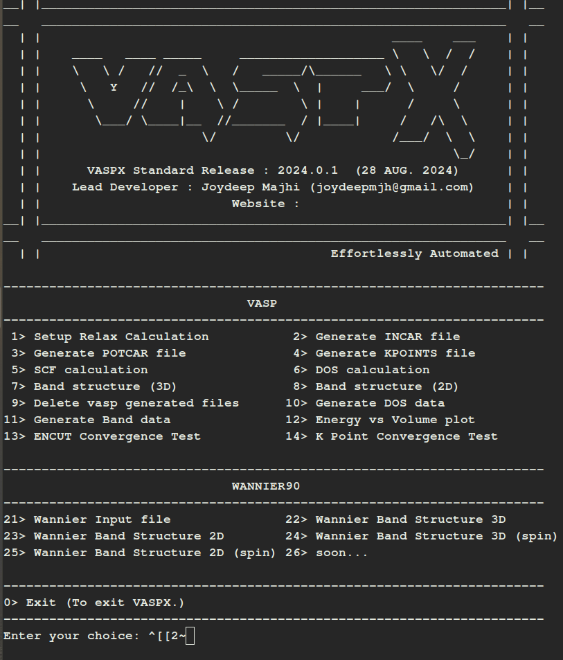

 A lightweight and user-friendly package for pre- and post-processing of VASP (Vienna Ab initio Simulation Package) calculations. 
 This toolkit simplifies the generation of input files and the extraction and visualization of output data from VASP simulations. 
 Designed for researchers working in computational materials science and condensed matter physics, it supports common tasks such as 
 structure preparation, k point path generation, output parsing, and plotting of electronic structure results.

Features:
- Automated generation of POSCAR, INCAR, KPOINTS, and POTCAR stubs
- Extraction and parsing of VASP output files (e.g., OUTCAR, DOSCAR, EIGENVAL)
- Plotting support for band structures, density of states, PDOS, and more
- Generation of Wannier90 input files
- Generation of Phonopy input files
- Shell-script based with minimal dependencies

  ## Installation
  Installation guide will be provided soon...

  ## Overview

  

  

